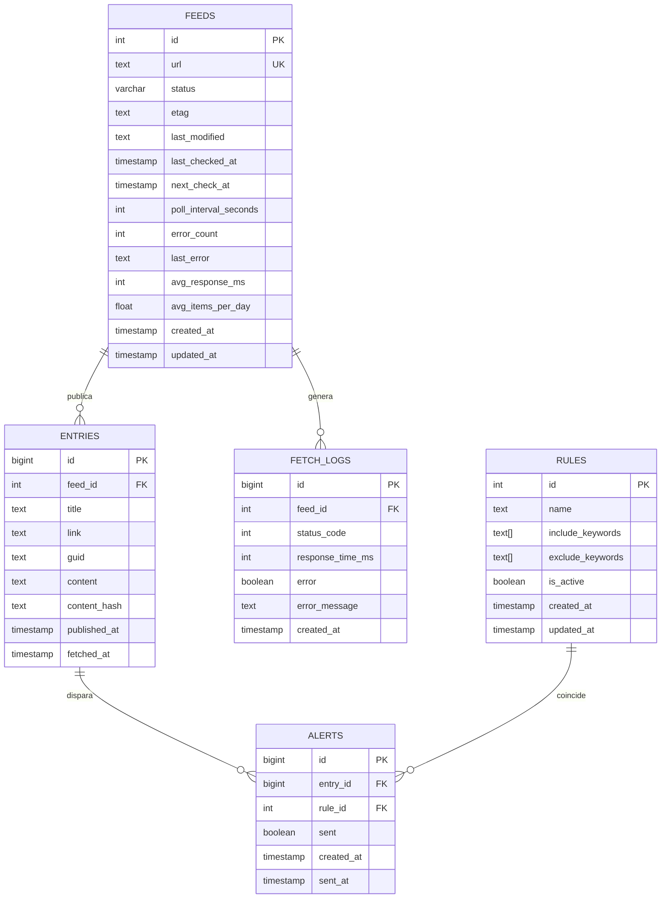
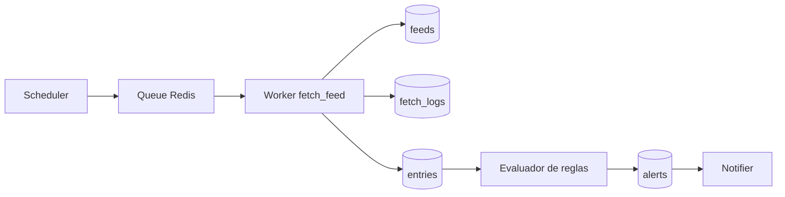

# Plan de diseno de base de datos - MVP

## 1. Objetivo

Este documento convierte el PRD en un plan de implementacion para la persistencia del MVP de la plataforma de monitorizacion RSS/Atom. El objetivo es soportar hasta 10.000 feeds, polling adaptativo, deduplicacion de entries, reglas por keywords y generacion de alertas con una base relacional simple, consistente y operable.

## 2. Principios de arquitectura de datos

- PostgreSQL es la fuente de verdad del MVP.
- Redis queda fuera del modelo persistente y se usa solo como cola efimera.
- El modelo prioriza consistencia y trazabilidad sobre optimizaciones prematuras.
- La deduplicacion se resuelve en capa de aplicacion y con restricciones SQL.
- El diseno deja preparado el crecimiento hacia multi-tenant, pero no lo implementa en el MVP.

## 3. Alcance MVP vs fases futuras

### MVP

- Persistir feeds, entries, logs de fetch, reglas y alertas.
- Guardar metadatos de polling: `etag`, `last_modified`, `next_check_at`, `error_count`.
- Permitir consultas operativas para API, scheduler, workers y observabilidad basica.
- Registrar alertas generadas y su estado de envio.

### Fase futura

- Multi-tenant real con `tenant_id` en entidades principales.
- Historial detallado de entregas por canal (`alert_deliveries`).
- Auditoria de cambios de reglas y feeds.
- Particionado de `entries` y `fetch_logs` por volumen.
- Busqueda full-text avanzada o motor dedicado.

## 4. Vista general del modelo



## 5. Flujo de datos principal



## 6. Entidades del MVP

### 6.1 `feeds`

Responsabilidad: registrar cada feed monitorizado y su estado operativo.

Campos clave:

- `url`: identificador unico del feed.
- `status`: `active`, `paused`, `error`.
- `etag`, `last_modified`: optimizacion HTTP para 304.
- `last_checked_at`, `next_check_at`: control del scheduler.
- `poll_interval_seconds`: intervalo base del feed.
- `error_count`, `last_error`: salud del feed.
- `avg_response_ms`, `avg_items_per_day`: base para polling adaptativo.
- `updated_at`: recomendado para trazabilidad operativa.

Decisiones:

- Mantener estado operativo en la misma fila simplifica scheduler y API.
- `next_check_at` requiere indice dedicado para extraer trabajo pendiente con baja latencia.
- `status` debe modelarse con `CHECK` o enum controlado a nivel de aplicacion.

### 6.2 `entries`

Responsabilidad: almacenar items normalizados detectados en los feeds.

Campos clave:

- `feed_id`: relacion con feed origen.
- `guid`, `link`, `content_hash`: base de deduplicacion.
- `title`, `content`: campos usados por reglas MVP.
- `published_at`: orden funcional para consultas y alertas.
- `fetched_at`: momento real de ingesta.

Decisiones:

- El PRD propone `UNIQUE(feed_id, guid)` y `UNIQUE(feed_id, content_hash)`; se mantiene para el MVP.
- Se recomienda agregar un indice compuesto `feed_id, published_at DESC` para listados por feed.
- Cuando `guid` no exista o sea inestable, la aplicacion cae a `link` y `content_hash` antes de insertar.

### 6.3 `fetch_logs`

Responsabilidad: registrar resultados de cada intento de fetch para diagnostico, metricas y soporte de salud.

Campos clave:

- `status_code`, `response_time_ms`: telemetria basica.
- `error`, `error_message`: causa de fallo.
- `created_at`: serie temporal de eventos.

Decisiones:

- El MVP guarda logs minimales; no se persiste cuerpo HTTP.
- Esta tabla puede crecer rapido; definir politica de retencion desde el inicio.
- Recomendado indice `feed_id, created_at DESC` para inspeccion operativa.

### 6.4 `rules`

Responsabilidad: definir matching por keywords include/exclude para generar alertas.

Campos clave:

- `name`: identificador legible.
- `include_keywords`, `exclude_keywords`: arrays del MVP.
- `is_active`: habilitacion operativa.

Decisiones:

- Para MVP, las reglas son globales; no se modela ownership por usuario o tenant.
- El matching se aplica sobre `title` y `content`, alineado con el PRD.
- Se recomienda `updated_at` para soporte de cache y auditoria basica.

### 6.5 `alerts`

Responsabilidad: persistir cada coincidencia entre una entry y una regla, junto con el estado de envio.

Campos clave:

- `entry_id`, `rule_id`: identifican el match.
- `sent`: estado simple del MVP.
- `sent_at`: recomendado para trazabilidad de entrega.
- `created_at`: timestamp de generacion.

Decisiones:

- Para evitar duplicados funcionales, se recomienda `UNIQUE(entry_id, rule_id)`.
- `sent` cubre el MVP, pero una fase futura debe separar alerta generada de intento de entrega.

## 7. Arquitectura logica de datos

### Lecturas criticas

- Scheduler: `feeds` filtrando `next_check_at <= now()` y `status = 'active'`.
- API de feeds: `feeds` con orden por prioridad operativa.
- API de entries: `entries` con filtros por `feed_id`, fecha y texto basico.
- API de alerts: `alerts` unida con `entries` y `rules` para contexto.
- Observabilidad: agregaciones sobre `fetch_logs`, `feeds` y `alerts`.

### Escrituras criticas

- Worker actualiza metadatos en `feeds` despues de cada fetch.
- Worker inserta `fetch_logs` por cada ejecucion.
- Worker inserta `entries` nuevas tras deduplicacion.
- Evaluador de reglas inserta `alerts` generadas.
- Notifier actualiza `alerts.sent` y `alerts.sent_at`.

### Integridad y consistencia

- Usar transacciones por feed procesado cuando se graben entries y alertas relacionadas.
- Mantener restricciones unicas para reforzar idempotencia.
- Controlar `ON DELETE` explicitamente: el MVP debe preferir borrado logico o restriccion sobre cascadas agresivas.

## 8. Indices recomendados para MVP

```sql
CREATE INDEX idx_feeds_next_check_active
ON feeds (next_check_at)
WHERE status = 'active';

CREATE INDEX idx_entries_feed_published
ON entries (feed_id, published_at DESC);

CREATE INDEX idx_fetch_logs_feed_created
ON fetch_logs (feed_id, created_at DESC);

CREATE INDEX idx_alerts_sent_created
ON alerts (sent, created_at DESC);
```

Notas:

- El indice parcial en `feeds` reduce el coste del scheduler.
- Los indices de series temporales mejoran listados recientes y dashboards MVP.
- No introducir GIN/GIST en el MVP salvo que la busqueda real lo exija.

## 9. Reglas de deduplicacion

Orden operativo alineado con el PRD:

1. `guid`
2. `link`
3. `content_hash`

Plan de implementacion:

- Normalizar strings antes de calcular hash.
- Generar `content_hash = sha256(title + link + published_at)` cuando no exista mejor identificador.
- Tratar `guid` vacio como nulo funcional.
- Registrar en logs el motivo de descarte de duplicados solo a nivel de aplicacion, no en base de datos.

## 10. Retencion y crecimiento

### MVP

- `fetch_logs`: retencion de 30 a 90 dias segun capacidad real.
- `entries`: retencion completa en MVP salvo restriccion de negocio.
- `alerts`: retencion completa para trazabilidad.

### Fase futura

- Particionado mensual de `entries` y `fetch_logs`.
- Archivado frio de logs.
- Materialized views para metricas pesadas.

## 11. Riesgos y mitigaciones

| Riesgo | Impacto | Mitigacion MVP |
| --- | --- | --- |
| Alto volumen en `fetch_logs` | Crecimiento rapido y consultas lentas | Retencion, indice temporal y dashboards acotados |
| Duplicados por feeds inconsistentes | Alertas repetidas | Restricciones SQL + dedupe en aplicacion |
| Borrado fisico de feeds con historial | Perdida de trazabilidad | Preferir desactivacion o borrado logico |
| Busquedas de texto pobres | Experiencia API limitada | Mantener filtros simples en MVP y marcar mejoras futuras |

## 12. Checklist de implementacion

- Crear migraciones para las 5 tablas base.
- Agregar `updated_at` en `feeds` y `rules`.
- Agregar `sent_at` y `UNIQUE(entry_id, rule_id)` en `alerts`.
- Definir enums o checks para estados de feed.
- Crear indices operativos del scheduler y listados.
- Documentar politica de retencion de `fetch_logs` desde el arranque.

## 13. Estado de readiness

El modelo propuesto es implementable para el MVP. Cubre persistencia, operaciones criticas, deduplicacion y observabilidad minima sin introducir complejidad innecesaria. Las extensiones de multi-tenant, auditoria fina y escalado por particionado quedan explicitamente fuera de alcance de la primera entrega.
