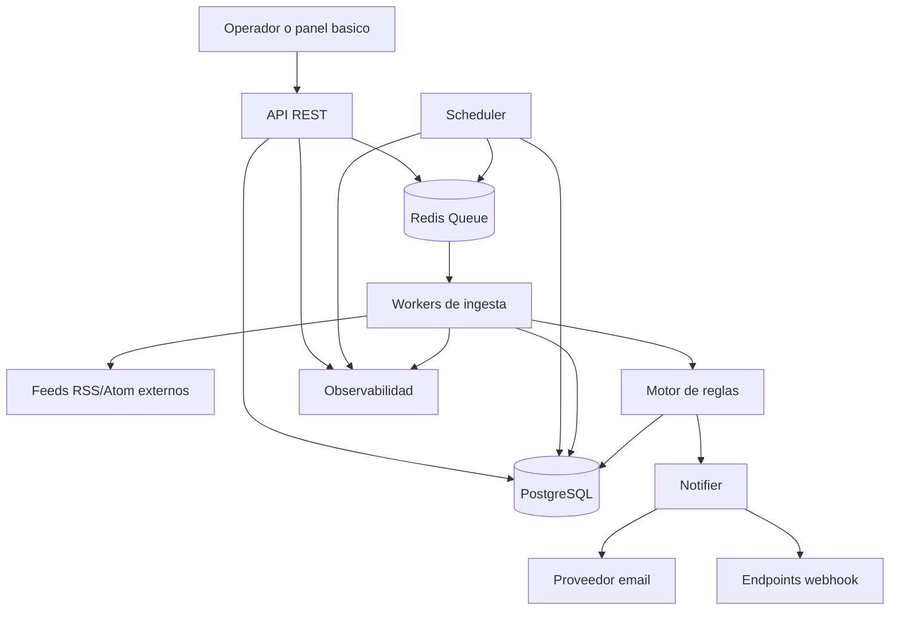
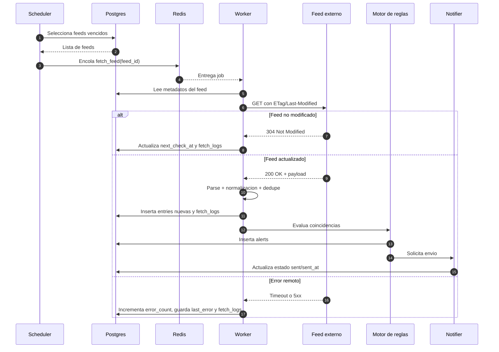
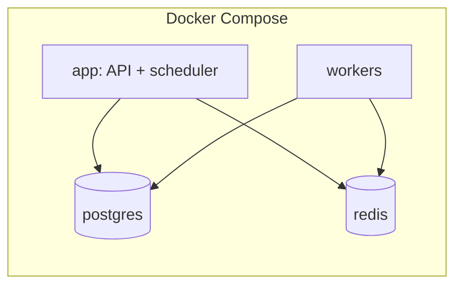

# Plan de arquitectura del sistema - MVP

## 1. Objetivo

Este documento describe la arquitectura del MVP para una plataforma de monitorizacion de hasta 10.000 feeds RSS/Atom. Expande el PRD hacia una vista implementable de componentes, flujos, scheduler, workers, cola, observabilidad, despliegue, escalado y seguridad.

## 2. Principios de arquitectura

- Separar ingestion, procesamiento y exposicion API para aislar carga.
- Mantener PostgreSQL como fuente de verdad y Redis como cola ligera.
- Priorizar operaciones idempotentes y tolerantes a fallos.
- Escalar horizontalmente workers antes de complejizar la arquitectura.
- Implementar observabilidad minima desde el primer despliegue.

## 3. Alcance MVP vs fases futuras

### MVP

- API REST para feeds, entries, rules, alerts, health y metrics.
- Scheduler simple que selecciona feeds vencidos y encola trabajos.
- Workers async para fetch, parse, dedupe y evaluacion de reglas.
- Notifier para email y webhook.
- Observabilidad minima con logs, metricas y health checks.
- Despliegue base con Docker Compose.

### Fase futura

- Separar scheduler y API en procesos dedicados si la carga lo exige.
- Multi-tenant real y aislamiento de datos.
- Circuit breaker por dominio avanzado.
- Autoscaling basado en lag de cola y latencia.
- Trazas distribuidas y dashboards avanzados.

## 4. Vista de contenedores del sistema

## 5. Responsabilidades por componente

### API REST

Responsabilidades MVP:

- Administrar feeds, rules y consultas de entries y alerts.
- Exponer `health` y `metrics`.
- Validar inputs y aplicar rate limiting.

No debe hacer:

- Fetch de feeds en linea.
- Procesamiento pesado de reglas.
- Envios sincronicos de alertas como flujo principal.

### Scheduler

Responsabilidades MVP:

- Buscar feeds listos para revisar (`next_check_at <= now`).
- Aplicar limite por tick para evitar picos.
- Encolar jobs de fetch.
- Recalcular `next_check_at` segun actividad y errores.

Decisiones:

- Puede convivir con la API en el mismo despliegue del MVP, pero como proceso separado dentro del mismo servicio o contenedor.
- Debe ser seguro ante ejecuciones duplicadas mediante locking simple o claim atomico en base de datos.

### Workers de ingesta

Responsabilidades MVP:

- Consumir jobs de Redis.
- Ejecutar fetch con `ETag` y `Last-Modified`.
- Parsear RSS/Atom.
- Normalizar y deduplicar entries.
- Persistir resultados y logs de fetch.
- Invocar evaluacion de reglas y generacion de alertas.

### Motor de reglas

Responsabilidades MVP:

- Evaluar include/exclude keywords sobre `title` y `content`.
- Crear alertas idempotentes por `entry_id + rule_id`.

Decision:

- Para el MVP, puede estar embebido en el worker; no requiere servicio separado.

### Notifier

Responsabilidades MVP:

- Enviar email y webhook.
- Marcar alertas enviadas o fallidas.
- Mantener politicas simples de retry.

Decision:

- Puede ejecutarse como parte del worker o como cola secundaria si el throughput lo requiere.

### Observabilidad

Responsabilidades MVP:

- Logs estructurados.
- Metricas Prometheus.
- Health checks de dependencias criticas.

## 6. Flujo principal de ingestion

## 7. Scheduler y estrategia de polling

### Loop operativo

- Tick cada 15 a 60 segundos.
- Seleccion por lotes de hasta 500 feeds por tick, alineado con el PRD.
- Orden recomendado: `next_check_at ASC`, priorizando feeds vencidos.

### Politica adaptativa MVP

| Estado del feed | Intervalo objetivo |
| --- | --- |
| Muy activo | 5 a 10 min |
| Normal | 15 a 30 min |
| Inactivo | 1 a 3 h |
| Error | backoff exponencial |

### Reglas operativas

- Reducir intervalo cuando el feed produce novedades de forma sostenida.
- Aumentar intervalo cuando el feed no cambia.
- Aplicar backoff ante errores repetidos.
- Limitar reintentos para no castigar dominios caidos.

## 8. Cola y procesamiento async

### Redis como cola MVP

Ventajas:

- Simple de operar.
- Suficiente para desacoplar scheduler y workers.
- Adecuado para throughput inicial.

Trade-offs:

- Menos garantias que un broker mas pesado.
- Requiere idempotencia en workers para tolerar reentregas.

### Requisitos de la cola

- Payload minimo: `feed_id`, `attempt`, `queued_at`.
- Retry con backoff.
- Dead-letter simple o contador de intentos para inspeccion.
- Metricas de profundidad de cola y jobs fallidos.

## 9. Observabilidad

### Logs estructurados

Campos minimos:

- `timestamp`
- `level`
- `service`
- `request_id` o `job_id`
- `feed_id` cuando aplique
- `status_code` o resultado de procesamiento
- `duration_ms`

### Metricas MVP

- feeds activos vs en error
- error rate por dominio
- duracion media de fetch
- entries ingeridas por minuto
- alertas generadas y enviadas
- profundidad de cola

### Health checks

- API viva
- conexion a PostgreSQL
- conexion a Redis
- capacidad minima de scheduler/workers para procesar trabajo

## 10. Despliegue

### Topologia MVP

Servicios minimos del PRD:

- `app` para API y scheduler
- `workers`
- `postgres`
- `redis`

Recomendaciones:

- Variables de entorno centralizadas.
- Volumen persistente para PostgreSQL.
- Limites de recursos desde el inicio.
- Reinicio automatico en fallos transitorios.

## 11. Escalado

### Estrategia MVP

- Escalar horizontalmente workers primero.
- Mantener una sola instancia activa de scheduler o usar mecanismo de liderazgo.
- Escalar API segun trafico del panel y clientes externos.

### Señales para escalar

- Crece la profundidad de cola.
- Aumenta el tiempo medio desde `next_check_at` hasta procesamiento real.
- Sube la latencia de API o el uso de CPU de workers.

### Fase futura

- Separacion fisica API, scheduler y notifier.
- Autoscaling por metrica de lag.
- Sharding funcional por dominio o segmento de feeds.

## 12. Seguridad

### Controles MVP

- Rate limiting en API.
- Validacion estricta de URLs de feeds.
- Timeouts agresivos y limites de tamano de respuesta en workers.
- Sanitizacion de HTML antes de persistir o exponer contenido reutilizable.
- Secretos por variables de entorno, nunca hardcoded.

### Riesgos operativos

- SSRF al consumir URLs arbitrarias.
- Saturacion por feeds lentos o maliciosos.
- Duplicados por reintentos concurrentes.
- Webhooks hacia endpoints no confiables.

Mitigaciones:

- Allowlist o validaciones de red segun entorno.
- Concurrency limits por worker.
- Idempotencia en insercion de entries y alerts.
- Timeouts, retries acotados y circuit breaker por dominio en fase futura.

## 13. Riesgos y supuestos

| Tipo | Punto | Impacto |
| --- | --- | --- |
| Supuesto | Redis alcanza para la cola del MVP | Simplifica operacion inicial |
| Supuesto | API y scheduler pueden convivir en `app` | Reduce complejidad de despliegue |
| Riesgo | Un solo scheduler sin liderazgo puede duplicar trabajo | Requiere lock o despliegue controlado |
| Riesgo | Alertas sincronicas degradan workers | Conviene desacoplar si sube el volumen |
| Riesgo | Falta de retencion en logs aumenta costes | Debe definirse desde el arranque |

## 14. Checklist de implementacion

- Definir proceso `app` con API y scheduler separados logicamente.
- Implementar cola Redis con retry y backoff.
- Crear worker idempotente con soporte 304 y dedupe.
- Instrumentar logs, metricas y health checks.
- Asegurar locking o liderazgo del scheduler.
- Configurar Compose con recursos y variables de entorno.

## 15. Estado de readiness

La arquitectura propuesta es implementable para el MVP y cubre los componentes y flujos necesarios para una primera version operativa. El diseno mantiene bajo acoplamiento, permite escalar por workers y deja claramente separadas las mejoras de fases futuras sin desbordar el alcance inicial.
