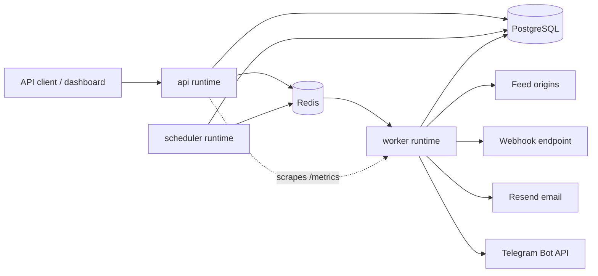
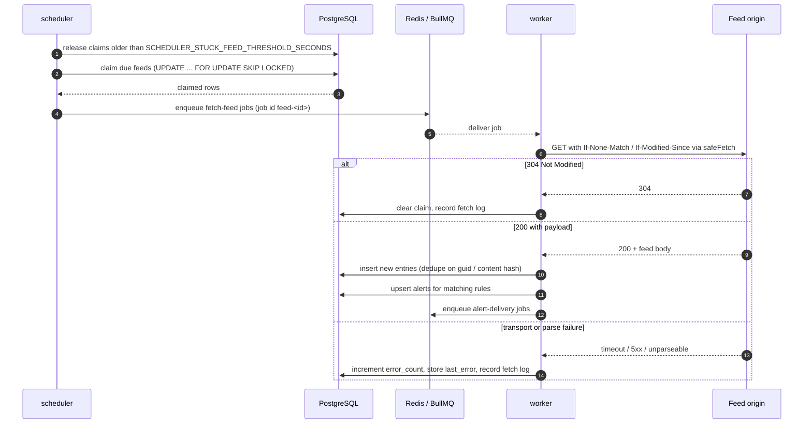

# Architecture

FeedPulse polls RSS/Atom feeds, matches new entries against tenant-defined keyword rules,
and delivers one alert per matched article through webhook, email and Telegram channels.
This document describes how the running system is put together and why each seam is where
it is.

## 1. Three runtimes, one image

The same Docker image runs three processes. They share the Nest module graph
(`src/app.module.ts`) and therefore the same repositories, configuration and logging, but
each one starts a different entry point.

| Process     | Entry point             | Responsibility                                                                                              |
| ----------- | ----------------------- | ----------------------------------------------------------------------------------------------------------- |
| `api`       | `src/main/api.ts`       | HTTP surface: REST API, Swagger UI, static operator dashboard, health, readiness and metrics.               |
| `scheduler` | `src/main/scheduler.ts` | Timer loop: releases stranded feed claims, claims due feeds, enqueues fetch jobs, flushes Telegram digests. |
| `worker`    | `src/main/worker.ts`    | BullMQ consumer for four queues, plus its own metrics HTTP server on `WORKER_METRICS_PORT`.                 |

Splitting them is what makes the load profiles independent: the API scales with dashboard
and client traffic, the worker scales with feed count, and the scheduler is a single small
loop that must not be multiplied.



Shutdown ordering is load-bearing. Nest tears modules down in reverse registration order,
so `IngestionModule` is registered last in `AppModule`; that is what lets `WorkerRunner`
drain in-flight BullMQ jobs before `QueueModule` closes Redis and `DatabaseModule` closes
the `pg` pool.

## 2. Ports and adapters

The layout is hexagonal, applied where it buys something rather than everywhere for
symmetry. A module owns its HTTP edge, its use cases, its domain rules and its repository:

```
src/modules/<module>/
├── http/            controllers — parse, delegate, wrap the response envelope
├── application/     use cases — the business operation, one class per operation
├── domain/          pure logic and ports (interfaces), no framework, no I/O
├── dto/             request/response contracts with class-validator decorators
└── *.repository.ts  SQL, and only SQL
```

The two ports that actually have more than one implementation are the ones that leave the
process:

- `AlertNotifierPort` (`src/modules/notifications/domain/alert-notifier.port.ts`) —
  implemented by `WebhookAlertNotifier` and by `NoopAlertNotifier`. `NotificationsModule`
  picks between them at wiring time based on whether a webhook URL is configured, so the
  rest of the system never branches on "is notification enabled".
- `FeedFetcherPort` (`src/modules/ingestion/domain/feed-fetcher.port.ts`) — implemented by
  `HttpFeedFetcher`, and replaced by a fake in the unit suites. This is what makes
  ingestion testable without the network.

The queue is treated the same way: `src/infrastructure/queue/queue.constants.ts` declares
`FetchFeedQueuePort`, `AlertDeliveryQueuePort`, `OpmlParsePreviewQueuePort` and
`OpmlApplyImportQueuePort` as interfaces, with BullMQ adapters behind them.

Why this and not a repository interface for every table: a port earns its keep when there
is a second implementation, a test double, or a boundary you genuinely intend to swap.
PostgreSQL is not being swapped, so the repositories talk raw SQL directly (see
[ADR 0001](./adr/0001-raw-sql-migrations.md)).

### Modules

| Module          | What it owns                                                                                 |
| --------------- | -------------------------------------------------------------------------------------------- |
| `feeds`         | Feed registration, lifecycle, per-tenant caps, URL probing, and the claim/sweep SQL.         |
| `rules`         | Keyword rules, single and batch creation, tenant-unique names.                               |
| `entries`       | Read-only listing of ingested entries with feed, date and full-text-ish filters.             |
| `alerts`        | Alert persistence, the atomic dedupe upsert, manual re-delivery, Telegram digest batching.   |
| `ingestion`     | The scheduler loop, the worker runners, keyword matching, per-domain outbound rate limiting. |
| `notifications` | Outbound alert channels and the per-tenant daily email quota.                                |
| `opml-imports`  | Asynchronous OPML upload, preview, confirm and apply pipeline.                               |
| `settings`      | Per-tenant integration settings and encrypted per-tenant Telegram bot tokens.                |
| `auth`          | API key records, and the public dashboard bootstrap config endpoint.                         |
| `observability` | Health, readiness, Prometheus registry, queue metrics, tenant-scoped ops summary.            |

Cross-cutting concerns live in `src/shared/`: Zod-validated configuration, the global
authentication guard, Redis-backed inbound rate limiting, the single exception filter, the
request-id interceptor, structured logging, the SSRF-aware fetch, and the shared text
normalizer.

## 3. Ingestion flow



Three properties of that loop are worth calling out.

**Claiming, not selecting.** `FeedsRepository.claimDueFeeds` is a single `UPDATE ... WHERE
id IN (SELECT ... FOR UPDATE SKIP LOCKED)` that pushes `next_check_at` forward and stamps
`claimed_at` in the same statement. Two schedulers racing therefore cannot both take the
same feed. See [ADR 0002](./adr/0002-bullmq-over-cron.md).

**The sweep runs before the claim.** A worker that dies between claiming and fetching
leaves `claimed_at` set and `next_check_at` already in the future, which would strand the
feed for a whole poll interval. `ReleaseStuckFeedsUseCase` runs first in every tick, so
recovery happens within one tick rather than one interval.

**Jitter on claim.** The new `next_check_at` is `poll_interval_seconds` plus a random
`min(300s, 20% of the interval)`. Without it, feeds registered together stay in lockstep
forever and every interval produces a thundering herd.

## 4. Alerting

Matching is pure and lives in `src/modules/ingestion/domain/keyword-match.ts`: an entry's
title and content are normalized once (NFD, diacritics stripped, lowercased, whitespace
collapsed), and each keyword is compiled into a Unicode word-boundary regex. Any include
keyword matching is enough; any exclude keyword vetoes. A rule with no effective include
keyword never matches, so an empty array can never become a match-all firehose.

Persistence is one statement. `AlertsRepository.createForEntryWithRules` performs a
multi-row `INSERT ... ON CONFLICT (tenant_id, COALESCE(canonical_link, 'entry:' ||
entry_id::text)) DO UPDATE` and returns `(xmax = 0) AS inserted`, which is true only for
tuples that statement actually inserted. That single flag separates "new alert, deliver
it" from "existing alert that merely gained another matching rule, do not re-deliver".
See [ADR 0003](./adr/0003-canonical-link-alert-dedupe.md).

Delivery state is tracked per channel — `webhook_delivery_status`,
`telegram_delivery_status`, `email_delivery_status` — so a retry after a Telegram outage
does not resend the webhook that already succeeded. See
[ADR 0004](./adr/0004-per-channel-delivery-tracking.md).

## 5. Outbound safety

Every outbound request whose target comes from stored data goes through `safeFetch`
(`src/shared/http/safe-fetch.ts`):

- `assertSafePublicUrl` rejects loopback, RFC1918, link-local (including the cloud metadata
  range `169.254.0.0/16`), IPv6 loopback/ULA, and `.localhost` / `.local` / `.internal` /
  `.home.arpa` suffixes. `ALLOW_PRIVATE_FEED_HOSTS=true` opts out, and the docker smoke and
  benchmark stacks are the only places that do.
- Redirects are followed manually (`redirect: 'manual'`, at most 5 hops) and **every hop is
  re-validated**. Validating once and letting `fetch` follow redirects is a bypass: a public
  origin can answer `302 Location: http://169.254.169.254/`.
- Response bodies are capped at `FEED_FETCH_MAX_BYTES` (5 MiB by default) while streaming,
  not after buffering.

What is deliberately _not_ implemented is DNS-rebinding protection; `url-safety.ts`
documents why, and pinning the connection to a validated IP is tracked as follow-up work.

Inbound traffic is limited too. `src/shared/http/throttler.module.ts` keeps per-tenant
counters in the same Redis instance BullMQ uses, so the ceiling holds across API replicas
instead of being multiplied by the replica count. There are two budgets: a default one for
every `/api/` route and a tighter `write` one for the endpoints that enqueue work or spend
the operator's outbound credentials.

## 6. Multi-tenancy

Every domain table carries `tenant_id`, and every repository query filters on it. The
tenant is resolved once per request by the global `AuthGuard` and read back through
`resolveTenantIdFromRequest`, so a controller cannot forget it — the helper throws
`missing_tenant_context` rather than falling back to a default.

Tenants come from API keys (`api_keys.tenant_id`) or, when `AUTH_PROVIDER` includes
`clerk`, are derived from the Clerk organization or subject. With `ENABLE_AUTH=false`
every request resolves to the shared `legacy` tenant; the environment schema refuses to
boot a `NODE_ENV=production` process in that mode.

## 7. Observability

- **Logs**: `nestjs-pino` with redaction, one structured line per request, correlated by
  the `x-request-id` the `RequestIdInterceptor` assigns or echoes.
- **Metrics**: a shared `prom-client` registry. The API's `/metrics` scrapes the worker's
  own metrics server and concatenates both registries, and records
  `feedpulse_worker_metrics_up` so a dead worker is visible instead of silently degrading
  into "API-only metrics with no feed activity".
- **Health**: `/health` answers from process state alone; `/ready` checks PostgreSQL,
  Redis and schema readiness and returns 503 when any of them fails.
- **Dead letters**: terminal BullMQ failures are written to `dead_letter_jobs` with a
  truncated payload, so a permanent failure survives the job being evicted from Redis.

## 8. Scaling posture

Scale the worker first: it is stateless, so **replica count is the throughput lever**.
`WORKER_CONCURRENCY` is not: `AppConfigService` clamps it to `3`, and clamps
`SCHEDULER_BATCH_SIZE` to `40`, regardless of what the environment sets. Both caps are
deliberate — they bound how much work one process can pull in before the per-domain
outbound rate limiter becomes the real constraint — but they are silent, so raising
either variable looks like it worked and does nothing. Add workers instead.

Scale the API with client and dashboard traffic. Do **not** run several schedulers for
throughput — the claim is safe under concurrency, but more schedulers only produce more
contention on the same rows, not more work.

The measured shape of the ingestion path is in [`local-benchmark.md`](./local-benchmark.md);
the committed chart covers 100 → 10,000 feeds against a deterministic local fixture.
