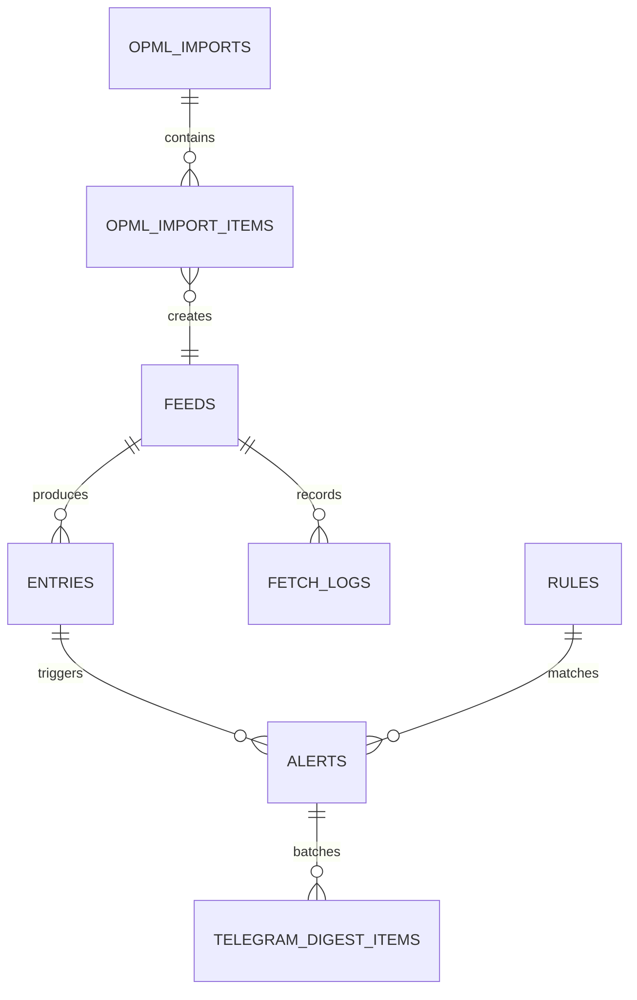

# Database

PostgreSQL is the source of truth. Redis holds only queue state and rate-limit counters, and
losing it costs at most the jobs currently in flight.

This page describes the schema that `db/migrations/0001_bootstrap.sql` through
`0021_tenant_secrets_key_version.sql` actually build, regenerated from a real migrated
database rather than from the original design document.

## Migration runner

Migrations are plain `.sql` files applied in filename order by `src/scripts/migrate.ts`
(`npm run migrate`). They are **never** applied at application boot. See
[ADR 0001](./adr/0001-raw-sql-migrations.md) for why there is no ORM migration tool.

Three properties matter operationally:

- **Serialized.** The whole run holds a session-level `pg_advisory_lock` on a dedicated
  connection (key `728314509`), so several replicas starting at once cannot execute the same
  DDL. A run that waits more than 60s fails with `MIGRATION_LOCK_TIMEOUT` instead of hanging.
- **Append-only, enforced.** `schema_migrations.checksum` stores the SHA-256 of each applied
  file, with CRLF normalized. Editing a migration that has already run fails the next
  deployment with `MIGRATION_CHECKSUM_MISMATCH` and tells you the next free version number.
- **Race-safe without the lock.** The "has this already run?" decision is made by
  `INSERT ... ON CONFLICT (version) DO NOTHING RETURNING version`, so even if the advisory
  lock were bypassed, the loser of a race skips the DDL rather than executing it and failing
  on the primary key afterwards.

`npm run migrate` also seeds `BOOTSTRAP_API_KEY` into `api_keys` when it is set, idempotently.
Without it a fresh deployment has no credential and every `/api/` call answers 401.

## Entity overview



Twelve tables exist in total: the seven above plus `tenant_settings`, `api_keys`,
`dead_letter_jobs`, `telegram_digest_items` and `schema_migrations`.

## Multi-tenancy

Migration 0006 added `tenant_id TEXT NOT NULL DEFAULT 'legacy'` to `feeds`, `entries`,
`rules`, `alerts`, `fetch_logs`, `opml_imports` and `opml_import_items`, backfilling
existing rows through their owning parent. `tenant_settings`, `api_keys` and
`telegram_digest_items` are keyed on the tenant directly.

Uniqueness is therefore always tenant-scoped: `idx_feeds_tenant_url_unique`,
`idx_feeds_tenant_normalized_url_hash_unique`, `idx_rules_tenant_name_unique` and
`idx_alerts_tenant_dedupe_key_unique` all lead with `tenant_id`. Two tenants can register
the same feed URL and name their rules identically without colliding.

## Tables

### `feeds`

Registered feeds and their operational state.

| Column                     | Type               | Notes                                                          |
| -------------------------- | ------------------ | -------------------------------------------------------------- |
| `id`                       | `serial` PK        |                                                                |
| `tenant_id`                | `text`             | Default `'legacy'`.                                            |
| `url`                      | `text`             | Unique per tenant.                                             |
| `normalized_url_hash`      | `text`             | Nullable. Unique per tenant when present; used by OPML dedupe. |
| `status`                   | `text`             | `CHECK (status IN ('active','paused','error'))`.               |
| `etag`, `last_modified`    | `text`             | Conditional-request cache validators.                          |
| `last_checked_at`          | `timestamptz`      |                                                                |
| `next_check_at`            | `timestamptz`      | Default `now()`. Drives the scheduler.                         |
| `claimed_at`               | `timestamptz`      | Migration 0015. Non-null while a fetch is in flight.           |
| `poll_interval_seconds`    | `integer`          | Default `1800`.                                                |
| `error_count`              | `integer`          | Default `0`.                                                   |
| `last_error`               | `text`             |                                                                |
| `avg_response_ms`          | `integer`          |                                                                |
| `avg_items_per_day`        | `double precision` |                                                                |
| `created_at`, `updated_at` | `timestamptz`      |                                                                |

Indexes: `idx_feeds_next_check_active` (partial, `WHERE status = 'active'`),
`idx_feeds_claimed_at` (partial, `WHERE claimed_at IS NOT NULL`),
`idx_feeds_tenant_created_at`, plus the two unique indexes above.

Both partial indexes exist because the queries that use them are hot and narrow: the
scheduler only ever looks at active feeds, and the stuck-feed sweep only ever looks at
claimed ones — at most `SCHEDULER_BATCH_SIZE × active workers` rows.

### `entries`

Normalized items ingested from feeds.

| Column                             | Type             | Notes                                                                          |
| ---------------------------------- | ---------------- | ------------------------------------------------------------------------------ |
| `id`                               | `bigserial` PK   |                                                                                |
| `feed_id`                          | `integer` FK     | → `feeds(id)`.                                                                 |
| `tenant_id`                        | `text`           |                                                                                |
| `title`, `link`, `guid`, `content` | `text`           |                                                                                |
| `content_hash`                     | `text NOT NULL`  | `sha256(link \| guid \| publishedAtIso)`.                                      |
| `published_at`                     | `timestamptz`    | Nullable — many feeds omit it.                                                 |
| `fetched_at`, `created_at`         | `timestamptz`    |                                                                                |
| `normalized_search_document`       | `text` GENERATED | `STORED`, from `feedpulse_normalize_search_text(title \|\| ' ' \|\| content)`. |

Deduplication is enforced by two unique constraints, `UNIQUE (feed_id, guid)` and
`UNIQUE (feed_id, content_hash)`, matching the application's own order of preference: `guid`
first, then the content hash derived from link, guid and publication timestamp.

Indexes: `idx_entries_feed_published`, `idx_entries_feed_published_id`,
`idx_entries_tenant_published` (`published_at DESC NULLS LAST, id DESC` — the null handling
matters because `published_at` is frequently missing), and a GIN index
`idx_entries_normalized_search_document_tsv` on
`to_tsvector('simple', normalized_search_document)`.

Note the honest limitation: `GET /api/v1/entries?search=` uses
`normalized_search_document ILIKE '%…%'`, which **cannot** use that GIN index. The index is
in place for a future full-text query path; today the search term is capped at 200
characters precisely because it drives a sequential scan.

### `rules`

| Column                     | Type              | Notes                     |
| -------------------------- | ----------------- | ------------------------- |
| `id`                       | `serial` PK       |                           |
| `tenant_id`                | `text`            |                           |
| `name`                     | `text NOT NULL`   | Unique per tenant (0020). |
| `include_keywords`         | `text[] NOT NULL` |                           |
| `exclude_keywords`         | `text[] NOT NULL` | Default `'{}'`.           |
| `is_active`                | `boolean`         | Default `true`.           |
| `created_at`, `updated_at` | `timestamptz`     |                           |

Migration 0020 added the tenant-unique name index, renaming pre-existing duplicates so the
index could be created on a live database.

### `alerts`

One row per matched **article** per tenant, not per rule. This is the table the two most
interesting decisions live in.

| Column                                                                       | Type                     | Notes                                                                    |
| ---------------------------------------------------------------------------- | ------------------------ | ------------------------------------------------------------------------ |
| `id`                                                                         | `bigserial` PK           |                                                                          |
| `tenant_id`                                                                  | `text`                   |                                                                          |
| `entry_id`                                                                   | `bigint` FK              | → `entries(id)`.                                                         |
| `rule_id`                                                                    | `integer` FK             | → `rules(id)`. The first rule that matched.                              |
| `matched_rules`                                                              | `integer[]`              | Migration 0013. Every rule that matched this article.                    |
| `canonical_link`                                                             | `text`                   | Migration 0012. Tracking-parameter-stripped article URL.                 |
| `sent`, `sent_at`                                                            | `boolean`, `timestamptz` | Aggregate delivery state.                                                |
| `delivery_status`                                                            | `text`                   | `pending` \| `queued` \| `retrying` \| `sent` \| `failed` \| `disabled`. |
| `delivery_attempts`                                                          | `integer`                |                                                                          |
| `last_delivery_attempt_at`, `last_delivery_queued_at`, `last_delivery_error` |                          | Retry bookkeeping.                                                       |
| `webhook_delivery_status`                                                    | `text`                   | `pending` \| `sent` \| `failed`.                                         |
| `telegram_delivery_status`                                                   | `text`                   | `pending` \| `sent` \| `failed`.                                         |
| `email_delivery_status`                                                      | `text`                   | `pending` \| `sent` \| `failed`.                                         |

The dedupe key is the expression index created by migration 0018:

```sql
CREATE UNIQUE INDEX idx_alerts_tenant_dedupe_key_unique
ON alerts (tenant_id, COALESCE(canonical_link, 'entry:' || entry_id::text));
```

The `COALESCE` fallback is not cosmetic. A partial index would not constrain `NULL`s at
all, so entries with no usable link would duplicate freely. `AlertsRepository` infers
`ON CONFLICT` from exactly this expression, byte for byte — PostgreSQL rejects the
statement at runtime if the two ever drift apart. See
[ADR 0003](./adr/0003-canonical-link-alert-dedupe.md) and
[ADR 0004](./adr/0004-per-channel-delivery-tracking.md).

Indexes: `idx_alerts_tenant_created`, `idx_alerts_sent_created`,
`idx_alerts_delivery_status_created`, plus three partial indexes on
`(id, tenant_id) WHERE <channel>_delivery_status = 'pending'` — one per channel, so the
"what still needs delivering on this channel" scan stays proportional to the backlog rather
than to the table.

### `fetch_logs`

One row per fetch attempt: `feed_id`, `tenant_id`, `status_code`, `response_time_ms`,
`error`, `error_message`, `created_at`. HTTP bodies are never stored.

This table grows fastest of all. There is currently **no retention job**; on a long-lived
deployment it needs one. Indexes: `idx_fetch_logs_feed_created`,
`idx_fetch_logs_tenant_created`.

### `api_keys`

| Column                                     | Type                   | Notes                                                           |
| ------------------------------------------ | ---------------------- | --------------------------------------------------------------- |
| `id`                                       | `bigserial` PK         |                                                                 |
| `tenant_id`                                | `text NOT NULL`        |                                                                 |
| `key_hash`                                 | `text NOT NULL` UNIQUE | `sha256` of the full plaintext key.                             |
| `prefix`                                   | `text NOT NULL`        | Stored in clear so a key is identifiable in the UI and in logs. |
| `label`                                    | `text`                 |                                                                 |
| `created_at`, `last_used_at`, `revoked_at` | `timestamptz`          | Revocation is a timestamp, not a delete.                        |

Lookup goes through `idx_api_keys_active_key_hash`, a partial index
`WHERE revoked_at IS NULL`, and the hash comparison itself is `timingSafeEqual`. The
plaintext key exists only in the output of `npm run apikey:create`.

### `tenant_settings`

Keyed on `tenant_id`. Holds `webhook_notifier_url`, `recipient_emails text[]`,
`telegram_chat_ids text[]`, `telegram_delivery_mode` (`instant` | `digest_10m`) and the
encrypted Telegram bot token as three columns — `telegram_bot_token_ciphertext`,
`telegram_bot_token_iv`, `telegram_bot_token_tag` — plus
`telegram_bot_token_key_version` (migration 0021).

The token is AES-256-GCM with an AAD binding the ciphertext to its tenant, under a key
derived with scrypt from `TENANT_SECRETS_MASTER_KEY`. The version column exists so stored
tokens can be re-encrypted on first read after a key rotation instead of silently failing
to decrypt.

### `telegram_digest_items`

Pending digest entries: `tenant_id`, `alert_id` (FK, `ON DELETE CASCADE`), `chat_id`,
`scheduled_for`, `sent_at`. `UNIQUE (alert_id, chat_id)` makes queueing idempotent, and the
partial index `idx_telegram_digest_items_pending` (`WHERE sent_at IS NULL`) is what the
scheduler's flush scans.

### `dead_letter_jobs`

Terminal BullMQ failures: `queue`, `job_id`, `payload jsonb`, `error`, `attempts`,
`failed_at`. Payloads over 8 KiB and errors over 2,000 characters are truncated — the OPML
parse job carries an entire uploaded document, and writing that verbatim on every permanent
failure would make this the largest table in the database.

`queue` is a closed set of four values, because it is also a Prometheus label and an open
label set there turns one time series into millions.

### `opml_imports` / `opml_import_items`

`opml_imports` tracks the lifecycle (`uploaded` → `parsing` → `preview_ready` → `importing`
→ `completed`, with `failed_validation` and `failed` terminal states) and carries the
counters the preview endpoint returns. All counters are `CHECK (… >= 0)`.

`opml_import_items` holds one row per outline, with `item_status` in
`new | existing | duplicate | invalid | imported | failed` and a check constraint requiring
`normalized_url` and `normalized_url_hash` on everything except `invalid` items. The partial
unique index `idx_opml_import_items_dedupe_per_import` de-duplicates within an import while
deliberately exempting rows already marked `duplicate`.

### `schema_migrations`

`version` (PK), `applied_at`, `checksum`. Written by the runner described above.

## Functions

Two SQL functions exist so that PostgreSQL and TypeScript can agree byte for byte.

| Function                                                 | Mirrors                                     |
| -------------------------------------------------------- | ------------------------------------------- |
| `feedpulse_normalize_search_text(text)`                  | `src/shared/text/normalize-search-text.ts`  |
| `feedpulse_entry_content_hash(link, guid, published_at)` | the content hash in `ProcessFeedJobUseCase` |

`feedpulse_normalize_search_text` is `IMMUTABLE PARALLEL SAFE` — it has to be, because
`entries.normalized_search_document` is a `STORED GENERATED` column over it. It performs
NFD normalization, strips combining diacritics, lowercases, collapses whitespace and trims.

Migrations 0012 and 0018 also define `normalize_alert_link`, the plpgsql mirror of
`src/modules/alerts/domain/canonical-article-link.ts`, used to backfill and re-link existing
alerts. `test/canonical-link-parity.integration-spec.ts` asserts the two implementations
agree; that parity is a hard requirement, because a backfilled row and a freshly ingested
row for the same article must collide on the same dedupe key.

## Working on the schema

- Add a new file; never edit one that has run. The checksum gate will stop you anyway.
- Prefer additive, nullable columns and `IF NOT EXISTS` so the migration is safe against a
  live database.
- Mirror the change in `test/support/schema.ts`. `test/schema-parity.integration-spec.ts`
  diffs the emulator schema against the real migrations and fails on anything not listed in
  `KNOWN_SCHEMA_DIVERGENCES`.
- Several migrations use SQL that the in-memory emulator does not implement, so the runner
  is only ever exercised against a real PostgreSQL. See [`testing.md`](./testing.md).
